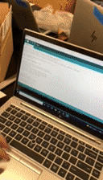

# Arduino MIDI Controller Project

## Introduction

Final Product

Hello! My name is Colin Tran and for my Digital Electronics Final Project, I decided I wanted to create a programmable MIDI controller. If you don't know, a MIDI controller is 
basically a macropad (keypad for certain commands/controls on a computer) but it is instead used specifically for music programs and for music creation/development. It's 
intended and base function is to be able to control different sounds and controls within a music program to help with music creation. MIDI Controllers can get pretty pricey and 
can range from one hundred dollars all the way to the thousands. By developing a arduino MIDI controller I could get similar functionality at a fraction of the cost.

## Part Selection

### Finding Parts

The first step of my process into creating a MIDI controller would be to find and acquire the different parts necessary to create a MIDI controller. What functionalities did I 
want in the MIDI controller? After deciding functionality I decided it would be best to start looking up other projects similar to mine and see what parts I would need. Research 
was key in finding what kind of parts I would need especially with this being a pretty hard project. Being that this is my first real 'solo' project I wanted to play it pretty 
safe and go with parts from a big manufacture like Adafruit. After some time spent within the resarch process I was able to find what I wanted and order them. This list came 
from the 'Mini Untztrument' a guide with which I modeled my MIDI Controller after. Some of the parts within the list included:

1 4x4 Adafruit Trellis Monochrome Driver - PCB For Project

1 Silicone Elastomer 4x4 button keypad - For Button Functionality

1 Arduino Leonardo - To input code

4 10k Potentiometers - Functionality for Dials

16x 3mm LEDs - Decoration and Testing

Premium Male Jumper Wires - Connection

14 #6-32 1/2' Flat Phillip Screws - To Put together Housing

Now that I had my parts I was almost ready to being the manufacturing process.

### CAD 

Images of the Cad turned into STL Files for printing.

The next step of part selection we needed to complete was finding or creating the CAD for our housing of the controller. The housing is basically the cover of the entire circuit 
and wiring of the project. With this project finding the CAD would be pretty easy as the creators provided a template of their housing with which we could use. For the purposes 
of my project, I ended up printing and using their premade housing. This later would prove to be a problem as some parts of the housing were misprinted.

## Manufacturing

### 3D Printing

To begin the 3D printing process, I begun by printing the top frame plate, then moving to the other frame parts afterwards. Each part took around 2-3 hours to complete, the 
longest print being the largest piece the main frame piece. After completing the prints for each of these separate parts, we were ready to assemble a basic structure of our MIDI 
controller housing.

MIDI Controller Housing After Print

### Soldering / Wiring

Now we can move onto the longest part of the manufacturing process, soldering and wiring all of the components. (Here most of the technical challenges came into play)
First off we had to prepare all our components so that they would be ready for assembly. This included:
1. Soldering all LEDS to the PCB
2. Soldering Jumper Wires to the PCB
3. Soldering Potentiometer Wires
Once we soldered most of the components I was able to actually move onto connecting the different components together into the Arduino so then we can actually control them.
Now we had to move onto controlling software and integrating our circuit into our code so we can test and troubleshoot.

### Code

Troubleshooting/Testing of MIDI

For my code, I mainly used the premade code given in the guide for this MIDI controller. But I also had to install multiple different arduino libraries. Once the code and 
everything was ready, tweaking code and troubleshooting errors took up a large time in actual code creation. At this point, we mainly just needed to test and troubleshoot the 
controller itself with this new code. 

## Resources
Project Guide - https://learn.adafruit.com/mini-untztrument-3d-printed-midi-controller
